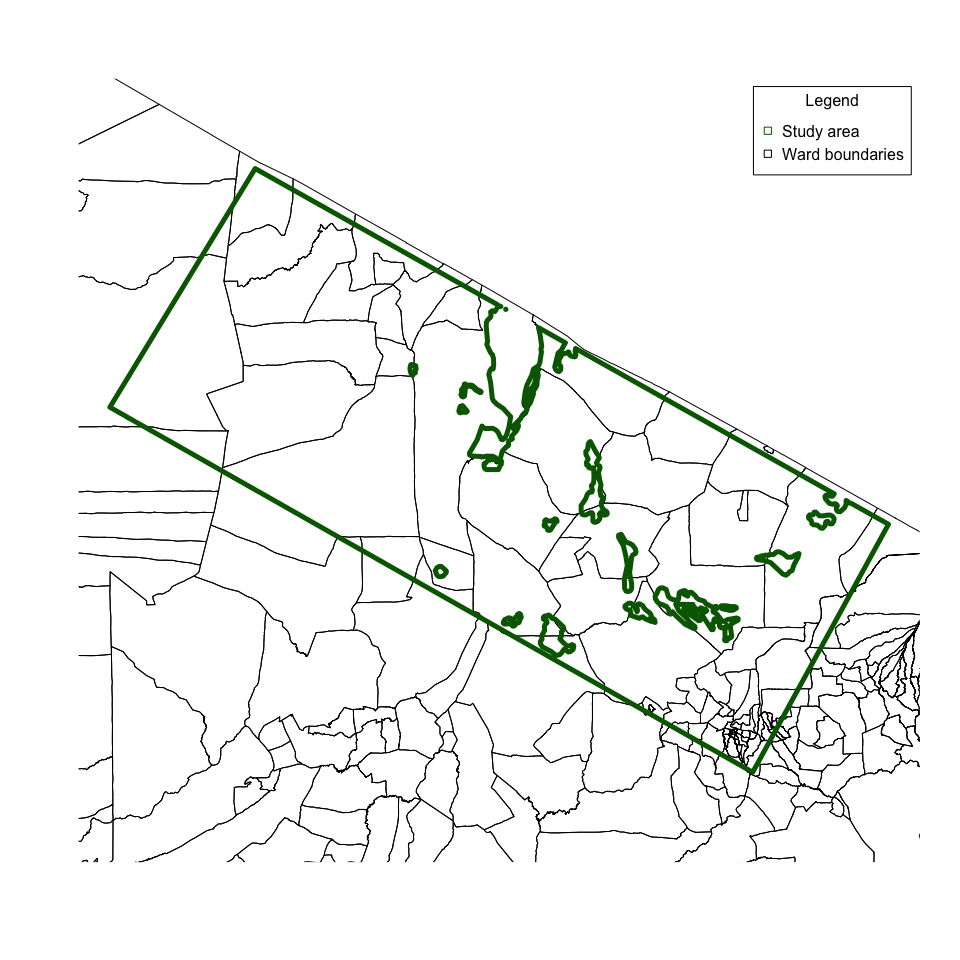
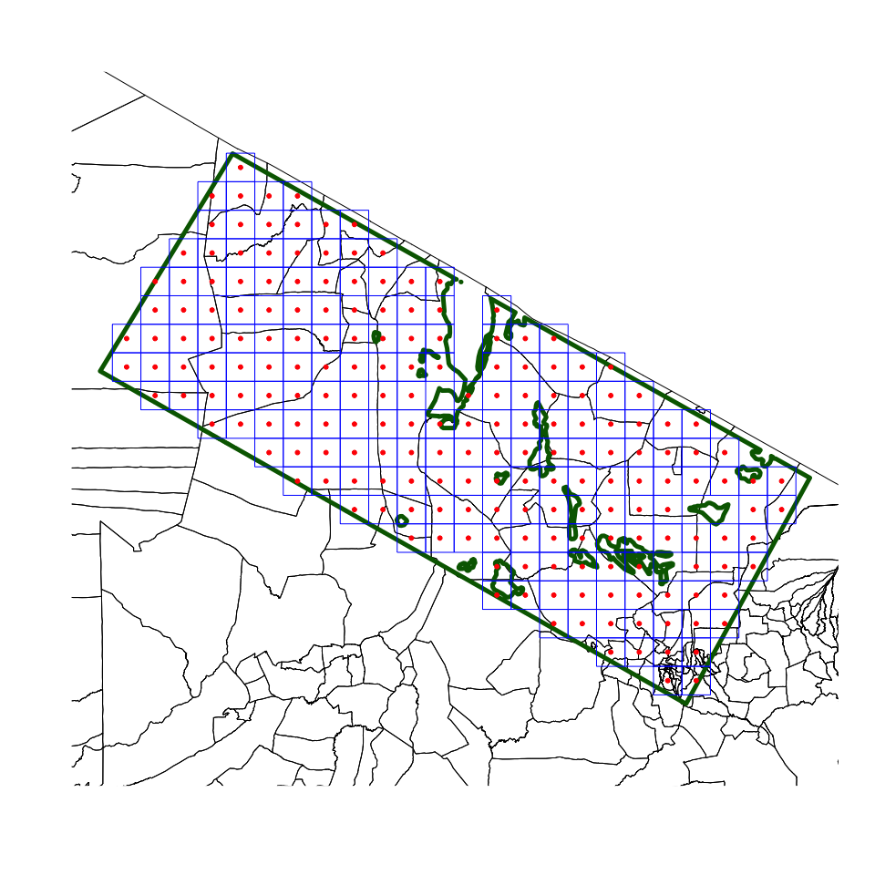

<!-- README.md is generated from README.Rmd. Please edit that file -->

# Shiny App for Spatial Sampling

<!-- badges: start -->

<!-- badges: end -->

Area sampling approaches such as **centric systematic area sampling** or
**CSAS** have potential applications in studies that sample from mixed
human and animal subjects, and from the environment. Standard sampling
approaches that select subjects proportional to population size (PPS)
are impractical for use in these studies because sampling units selected
for one subject will not necessarily be representative of the other
subjects. This is particularly true in contexts where animal population
size distribution is inversely related to human population size.

With **CSAS**, sampling of any subject is performed systematically over
geographic area and resulting sample is said to be spatially
representative. This type of sample is said to approximate a simple
random sample (SRS)\[1\]. Thus, a mixed human and animal
subject study can use the same spatial sampling frame for all subjects.
Additional advantages of a **CSAS** approach is that the resulting
sample is implicitly spatially stratified which contributes to increased
sampling variance\[2\]\[3\].

## Steps in CSAS

### Step 1: Find a map

The first step is to find a map of the study area. Try to find a map
with as much detail and features (e.g., towns, villages, landmarks, etc)
as possible.

Below is a map of a study area somewhere in Tanzania.

### Step 2: Draw a grid

The size of each square should be small enough for it to be reasonable
to assume homogeneity within the square. The size of the grid will also
be dictated by a target number of sampling units that you are aiming
for.

Below is an example of a grid overlaid onto the previous map to create
200 square grids

### Step 3: Select the areas to sample

The sampling points which are the centroids of the sampling grid points
us where to sample. For human and animal populations, this can be the
village or settlement at or near the centroid location. For
environmental sampling, this would be specimens drawn at or near the
centroid locations.

## Data analysis considerations

Data collected from this type of sampling frame can the be made
population representative by applying a population weighted analysis
during indicator/outcome estimation. This can be done parametrically
using Taylor linearised deviation techniques (which can be implemented
in [R](https://cran.r-project.org) using Thomas Lumley’s [survey
package](https://cran.r-project.org/web/packages/survey/survey.pdf) or
using a non-parametric weighted bootstrap approach such as described
[here](https://github.com/rapidsurvys/bbw).

## About the `spatialsampling` Shiny app

This [Shiny](https://cran.r-project.org/web/packages/survey/survey.pdf)
application assists users in the process of applying **CSAS** to a
specified study area. This application utilises the
[R](https://cran.r-project.org) package
[`spatialsampler`](https://github.com/spatialworks/spatialsampler) which
provides functions for performing **CSAS**.

To use the
[Shiny](https://cran.r-project.org/web/packages/survey/survey.pdf)
application, go to
<https://aegypti.echohealthalliance.org/shiny/guevarra/spatialsampling>.
When prompted for a username and password, please use your [EcoHealth
Alliance](https://www.ecohealthalliance.org) Google account credentials.

## References

1.  Milne, A. (1959). The Centric Systematic Area-Sample Treated as a
    Random Sample. Biometrics, 15(2), 270-297. <doi:10.2307/2527674>

2.  Aaron, G. et al. (2014) ‘Coverage of a market-based approach to
    deliver a complementary food supplement to infants and children in
    three districts in Eastern Ghana: use of the simple spatial survey
    method (S3M) (255.5)’, FASEB J, 28(1\_Supplement), pp. 255.5-.
    Available at:
    <http://www.fasebj.org/cgi/content/long/28/1_Supplement/255.5>
    (Accessed: 10 April 2015).

3.  Aaron, G. J. et al. (2016) ‘Household coverage of fortified staple
    food commodities in Rajasthan, India’, PLoS ONE, 11(10). doi:
    10.1371/journal.pone.0163176.
