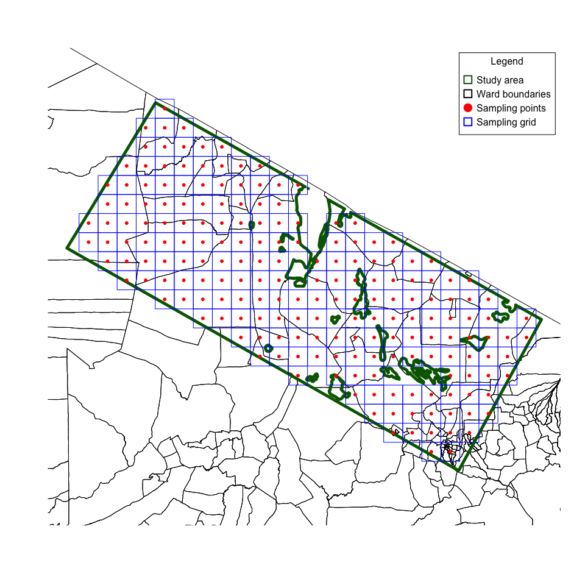

<!-- README.md is generated from README.Rmd. Please edit that file -->

# Shiny Application for Spatial Sampling

<!-- badges: start -->

[](https://www.repostatus.org/#active)

[](https://github.com/ecohealthalliance/spatialsampling/blob/master/LICENSE)
<!-- badges: end -->

Area sampling approaches such as **centric systematic area sampling** or
**CSAS** have potential applications in studies that sample from mixed
human and animal subjects, and from the environment. Standard sampling
approaches that select subjects proportional to population size (PPS)
are impractical for use in these studies because sampling units selected
for one subject will not necessarily be representative of the other
subjects. This is particularly true in contexts where animal population
size distribution is inversely related to human population size.

With **CSAS**, sampling of any subject is performed systematically over
geographic area and resulting sample is said to be spatially
representative. This type of sample is said to approximate a simple
random sample (SRS)<sup>\[1\]</sup>. Thus, a mixed human and animal
subject study can use the same spatial sampling frame for all subjects.
Additional advantages of a **CSAS** approach is that the resulting
sample is implicitly spatially stratified which contributes to increased
sampling variance<sup>\[2\]\[3\]</sup>.

## Steps in CSAS

### Step 1: Find a map

The first step is to find a map of the study area. Try to find a map
with as much detail and features (e.g., towns, villages, landmarks, etc)
as possible.

Below is a map of a study area somewhere in Tanzania.


### Step 2: Draw a grid

The size of each square should be small enough for it to be reasonable
to assume homogeneity within the square. The size of the grid will also
be dictated by a target number of sampling units that you are aiming
for.

Below is an example of a grid overlaid onto the previous map to create
200 square grids



### Step 3: Select the areas to sample

The sampling points, which are the centroids of the sampling grid,
indicates where to sample. For human and animal populations, this can be
the village or settlement or farm at or near the centroid location. For
environmental sampling, this would be specimens drawn at or near the
centroid locations.

<br>

## Data analysis considerations

Data collected from this type of sampling frame can the be made
population representative by applying a population weighted analysis
during indicator/outcome estimation. This can be done parametrically
using Taylor linearised deviation techniques (which can be implemented
in [R](https://cran.r-project.org) using Thomas Lumley’s [survey
package](https://cran.r-project.org/web/packages/survey/survey.pdf)<sup>\[4\]</sup>)
or using a non-parametric weighted bootstrap approach such as the one
described [here](https://github.com/rapidsurvys/bbw)<sup>\[5\]</sup>.

<br>

## About the `spatialsampling` Shiny application

This [Shiny](https://shiny.rstudio.com) application assists users in the
process of applying **CSAS** to a specified study area. This application
utilises the [R](https://cran.r-project.org) package
[`spatialsampler`](https://github.com/spatialworks/spatialsampler)<sup>\[6\]</sup>
which provides functions for performing **CSAS**.

The application can be accessed either via [EcoHealth
Alliance](https://www.ecohealthalliance.org)’s
[Shiny](https://shiny.rstudio.com) server, or locally by cloning this
[GitHub
repository](https://github.com/ecohealthalliance/spatialsampling).

### Accessing the Shiny application via the EHA server

To use the [Shiny](https://shiny.rstudio.com) application via [EcoHealth
Alliance](https://www.ecohealthalliance.org)’s
[Shiny](https://shiny.rstudio.com) server, go to
<https://aegypti.echohealthalliance.org/shiny/guevarra/spatialsampling>.
When prompted for a *username* and *password*, please use your
[EcoHealth Alliance](https://www.ecohealthalliance.org)
[Google](https://www.google.com) account credentials.

This is the most straightforward and easiest way of accessing the
[Shiny](https://shiny.rstudio.com) application.

### Accessing the Shiny application locally

To use the [Shiny](https://shiny.rstudio.com) application locally, you
will need to clone or download this [GitHub
repository](https://github.com/ecohealthalliance/spatialsampling) into
your local computer.

The figure below shows how to download this [GitHub
repository](https://github.com/ecohealthalliance/spatialsampling):

<br/>


<br/>

The repository will then be downloaded as a `.zip` file into your
default downloads folder. Unzip the contents of the `.zip` file into
your preferred local directory.

To clone this [GitHub
repository](https://github.com/ecohealthalliance/spatialsampling) via
`https`, type the following command in your terminal:

``` shell
git clone https://github.com/ecohealthalliance/spatialsampling.git
```

or via `ssh`:

``` shell
git clone git@github.com:ecohealthalliance/spatialsampling.git
```

Once you have downloaded or cloned the repository locally, open the
folder and then double-click the `spatialsampling.Rproj` file to open
the project in [RStudio](https://rstudio.com). Once on
[RStudio](https://rstudio.com), run the application using the following
command in the [R](https://cran.r-project.org) console:

``` r
if (!require(shiny)) install.packages("shiny")

shiny::runApp(launch.browser = TRUE)
```

Please note that there are [R](https://cran.r-project.org) packages
required for running the [Shiny](https://shiny.rstudio.com) application
that you may have to install if they are not already installed on your
local machine. This will most likley be the main issue that will arise
when running this application locally. Please install missing packages
as indicated in the resulting error messages (if any). Note also that
installation of [R](https://cran.r-project.org) spatial packages can be
tricky and a bit complicated.

This approach of accessing the [Shiny](https://shiny.rstudio.com)
application is more suitable for those who are more familiar with
running [Shiny](https://shiny.rstudio.com) applications locally, those
who would like to see the source code of the application and possibly
contribute to it via
[GitHub](https://github.com/ecohealthalliance/spatialsampling), and/or
those who are familiar and comfortable with installing
[R](https://cran.r-project.org) spatial packages. We recommend using
this second approach if you fall within the categories described above
or if you are up for a challenge\!

### Using the Shiny application

You will see the following on your web browser when you access the
[Shiny](https://shiny.rstudio.com) application either remotely on
[EHA](https://www.ecohealthalliance.org)’s
[Shiny](https://shiny.rstudio.com) server or locally through your copy
of the application.

<br>


<br>

The basic interface of the [Shiny](https://shiny.rstudio.com)
application is that of a map with an overlay menu on the upper right
hand corner where the user inputs a few required parameters to be used
for spatial sampling. When the menu is not in use, it turns transparent.
Hover your cursor over the menu and it will turn opaque allowing for the
menu buttons to be readable.

The following points describe the different input parameters for the
[Shiny](https://shiny.rstudio.com) application. These can also be found
as a quick start-up guide modal on the
[Shiny](https://shiny.rstudio.com) application itself which can be
accessed by clicking on the information link on the overlay menu.

#### Select study country

Select country where study is to be done.

Please note that once you have selected a country, the application will
download and read in the map boundary files for the specified country.

#### Upload study area map

Upload study area map in either shapefiles (SHP) or geopackage (GPKG)
format. If uploading shapefiles, select a zip file of a folder
containing the multiple files required.

To trial the application, the following sample study area maps for
specific countries can be downloaded and used for this step:

  - Bangladesh -
    [survey\_area\_bgd.gpkg](https://github.com/ecohealthalliance/spatialsampling/blob/main/maps/survey_area_bgd.gpkg?raw=true)

  - Jordan -
    [survey\_area\_jor.gpkg](https://github.com/ecohealthalliance/spatialsampling/blob/main/maps/survey_area_jor.gpkg?raw=true)

  - Liberia -
    [survey\_area\_lbr.gpkg](https://github.com/ecohealthalliance/spatialsampling/blob/main/maps/survey_area_lbr.gpkg?raw=true)

  - Philippines -
    [survey\_area\_phl.gpkg](https://github.com/ecohealthalliance/spatialsampling/blob/main/maps/survey_area_phl.gpkg?raw=true)

  - South Africa -
    [survey\_area\_zaf.gpkg](https://github.com/ecohealthalliance/spatialsampling/blob/main/maps/survey_area_zaf.gpkg?raw=true)

  - Tanzania -
    [survey\_area\_tza.gpkg](https://github.com/ecohealthalliance/spatialsampling/blob/main/maps/survey_area_tza.gpkg?raw=true)

Once a map file has been uploaded, this will be read and processed. Part
of this processing includes the subsetting of the country administrative
boundaries to those that are local to the study area map provided, and
the extraction of human and cattle population rasters appropriate for
the study area. When this process has completed, the study area and
administrative boundaries along with the human population raster will be
shown on the map while the cattle population raster is hidden but can be
activated via the layers menu on the bottom left side of the map.

#### Number of sampling units

Input the number of sampling units required or desired. For a human
population study, the recommended minimum number of sampling units is at
least 30 (default). This is the minimum number of sampling clusters
recommended to achieve sampling variance that will provide
proportion/prevalence estimates with ±3-5% precision. This should be
adjusted accordingly based on study’s target sample size and target
cluster size.

#### Set a sampling area buffer

Sometimes, it is necessary to add a buffer around the study area to be
able to spread the spatial sample evenly up to the edges. This buffer
can be specified here. By default, this is set to 0 for no buffer. The
buffer should be specified in kilometres (kms). This parameter is
optional but as a rule-of-thumb, it is recommended to add a buffer as
the study area increases and/or if your number of sampling units is
closer to 30.

#### Sample

Once the required number of sampling units has been specified, a spatial
sample can now be taken.

Click the sampling button and a sampling grid and sampling points based
on the specifications will be added to the map.

#### List

Once the sampling grid and the sampling points have been generated on
the map, a list of the sampling points and their identifying features,
geocoordinates, and human and cattle population weights is generated and
can be saved and downloaded by clicking this button.

#### Refresh

If you want to redo the spatial sampling for some reason or if you want
to do a spatial sample for a different country or a different study area
within the same country, click on the refresh button and then repeat the
steps above.

<br>

## Contributors

This [Shiny](https://shiny.rstudio.com) application was made possible by
contributions from:

  - [Ernest Guevarra](mailto:guevarra@ecohealthalliance.org)

  - [Melinda Rostal](mailto:rostal@ecohealthalliance.org)

  - [Rebecca Bodenham](mailto:bodenham@ecohealthalliance.org)

<br>

## License

This [Shiny](https://shiny.rstudio.com) application is made available
under a [MIT
license](https://github.com/ecohealthalliance/spatialsampling/blob/master/LICENSE).

<br>

## Issues and feedback

Feedback, bug reports and feature requests are welcome; file issues or
seek support
[here](https://github.com/ecohealthalliance/spatialsampling/issues).

<br>

## References

1.  Milne, A. (1959). The Centric Systematic Area-Sample Treated as a
    Random Sample. Biometrics, 15(2), 270-297. <doi:10.2307/2527674>

2.  Aaron GJ, Strutt N, Boateng NA, Guevarra E, Siling K, et al. (2016)
    Assessing Program Coverage of Two Approaches to Distributing a
    Complementary Feeding Supplement to Infants and Young Children in
    Ghana. PLOS ONE 11(10): e0162462.
    <https://doi.org/10.1371/journal.pone.0162462>

3.  Aaron, G. J. et al. (2016) ‘Household coverage of fortified staple
    food commodities in Rajasthan, India’, PLoS ONE, 11(10).
    <https://doi.org/10.1371/journal.pone.0163176>

4.  Lumley T. Analysis of complex survey samples. Journal of Statistical
    Software. 2004;9: 1–19. Available:
    <http://www.jstatsoft.org/v09/a08/paper>

5.  Mark Myatt (2018). bbw: Blocked Weighted Bootstrap. R package
    version 0.1.3. <https://CRAN.R-project.org/package=bbw>

6.  Mark Myatt, Farah Ibrahim and Ernest Guevarra (2018).
    spatialsampler: An Implementation of the Centric Systematic Area
    Sampling (CSAS) and Simple Spatial Sampling Method (S3M) sampling
    approaches in R. R package version 0.1.0.
    <https://github.com/spatialworks/spatialsampler>
